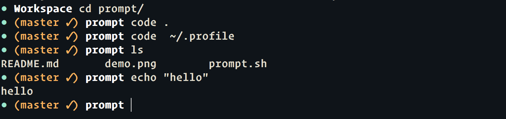

<h1 align="center">💻 unfancy-prompt</h1>
 

  <strong>A minimal bash prompt with git info 💻</strong>

 

    
    
   
   

 

  Built with ❤︎ by <a href="tiaanduplessis.co.za">Tiaan</a> and <a href="https://github.com/tiaanduplessis/bolt/graphs/contributors">contributors</a>

 

  

